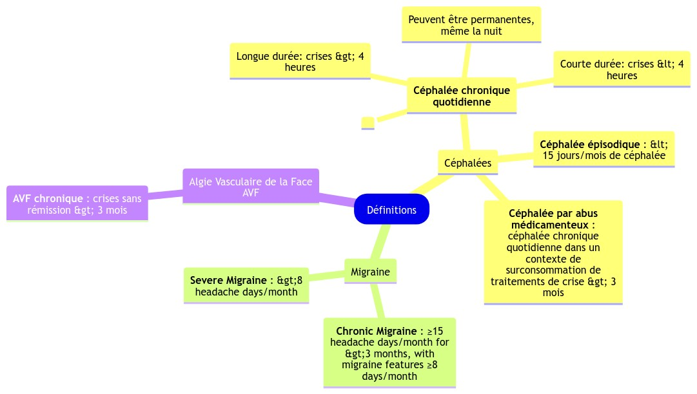

# AnkiAutoMindmap

**Check out my other Anki and AI related projects on my [GitHub profile](https://github.com/thiswillbeyourgithub)!**

From an anki tag, create a single file that contains all the information in an indented markdown format, then create several mermaid graph from it.

This is a quick script I made for myself, if you need help or have any question just open an issue.

Here's an example in french about headaches:


## Usage Example

```bash
python AnkiAutoMindmap.py \
    --profile_name "YourProfile" \
    --excl_tags="excluded_tag" \
    --notetype="YourNotetype" \
    --n_fields_to_keep=[0,3] \
    --output="/path/to/your/logseq/folder/" \
    --merge_batch=-10 \
    --toptags medical::neurology::headache \
    --merge_mode="dendrogram_merge"
```

